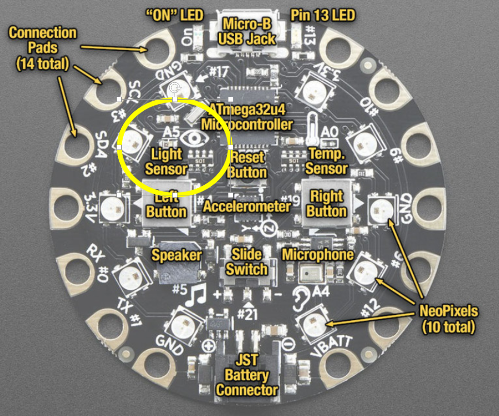

# Use the light sensor in an Adafruit Circuit Playground as an input device in a Processing program
In this Arduino lab you will write a program that gets input from the light sensor in the [Adafruit Circuit Playground](https://www.adafruit.com/product/3000) and uses it as an controller so that you can interact with your Virtual Pet from the [previous assignment](https://github.com/ATC-APCSA/VirtualPet).

### Step 1: Plug in the Adafruit Circuit Playground and start Processing
Connect the Circuit Playground to your computer with a USB cord. Open Processing. You will need to install a library (you only need to do this once). Choose *Sketch | Import Library | Manage Libraries*.  Type *Arduino* in the text field labeled *Filter*. Choose *Arduino (Firmata)* and click *Install*.

### Step 2: Run this sample program
Copy and paste the following program
```java {.line-numbers}
import processing.serial.*;
import cc.arduino.*;
Arduino arduino;

public void setup() {
  size(500, 500);
  arduino = new Arduino(this, Arduino.list()[0], 57600); //change the [0] to a [1] or [2] etc. if your program doesn't work
}

public void draw() {
  background(192);
  int y = arduino.analogRead(5);
  System.out.println(y);
  ellipse(250, 2*y, 50, 50);
}
```
Run the program. Pass your hand over the light sensor labeled with a picture of an eye on the Circuit Playground. You should see an ellipse move up and down as the light sensor changes values. Higher values mean more light. The light sensor is circled in the picture below. On some machines, you may need to change the last line in `setup()` to get the program to work correctly.


### Step 3: Write your own program
Using the sample program as a guide, write your own program that uses the light sensor. Your program doesn't have to work or look like any other. Have fun and be creative! 

### Step 4: Make a short video (under 10 seconds and smaller than 25MB)
When you are happy with your program, have a friend make a short video of you interacting with your virtual pet. The video need only show your hand, the arduino and your pet, please don't include anyone's face in the video. 

Convert the video to an animated gif using a free converter like [ezgif.com](https://ezgif.com/). Use ezgif's *cut video* or a similar option to edit your video to under 10 seconds and less than 25MB. Upload your animated gif to your VirtualPet repository. Submit the link to your gif in Canvas. 


Samples of Student Work
-----------------------
Ms. Padilla <br>
[Yailyn](https://github.com/yailyn441/VirtualPet_Part2/blob/main/IMG_89021-ezgif.com-video-to-gif-converter.gif) <br>
Elena <br>
Truman <br>
Ryan  <br>
Trinley <br>
Leto <br>
Melanie <br>
Rosa <br>
Amulya <br>
Diego <br>
Nico <br>
Giselle <br>


### How does the Arduino (Adafruit Circuit Playground) Code work? Since you may be wondering..

This program utilizes an Arduino light sensor (or any other analog sensor connected to analog pin 5) and visualizes the sensor data using a Processing sketch.

### Breakdown of the Program:
1. Libraries and Variables:

import processing.serial.*; and import cc.arduino.*; are the libraries that allow communication between Processing and Arduino.
Arduino arduino; declares a variable for the Arduino object, which facilitates communication between Processing and the Arduino board.

2. ```setup()``` Function:

The ```size(500, 500);``` function sets the window size to 500x500 pixels.
```arduino = new Arduino(this, Arduino.list()[0], 57600);``` connects to the first available Arduino device.
```Arduino.list()[0]``` retrieves the first connected Arduino from the list of serial ports.
The baud rate is set to 57600 (which should match the baud rate used in the Arduino sketch).
If there are multiple devices connected, you might need to change the [0] to a higher index ([1], [2], etc.) to select the correct port.

3. ```draw()``` Function:

```background(192);``` sets the background color to a gray shade (RGB 192).
int y = arduino.analogRead(5); reads the value from analog pin A5 on the Arduino board. The value read is between 0 and 1023, depending on the light intensity or other sensor input.
```System.out.println(y);``` prints the sensor reading (i.e., the analog value) to the console, so you can observe the sensor’s behavior in real-time.
```ellipse(250, 2*y, 50, 50);``` draws a circle (ellipse) in the window.
The x-coordinate of the circle is fixed at 250 (center of the window horizontally).
The y-coordinate is determined by the sensor reading, scaled by 2 (2*y), which moves the circle up or down depending on the input from the sensor.
The ellipse has a fixed size of 50x50 pixels.

### Key Functionality:
The program reads analog data from a light sensor (or any other sensor) connected to analog pin A5.
The value from the sensor controls the vertical position of a circle on the Processing window.
The more light (or the higher the sensor value), the lower the circle will be positioned (since higher values of y push the circle downward).

### Visualization:
When the light intensity increases, the circle moves downward.
When the light intensity decreases, the circle moves upward.
This creates a simple real-time visual representation of the sensor's data based on the Arduino's analog input.


